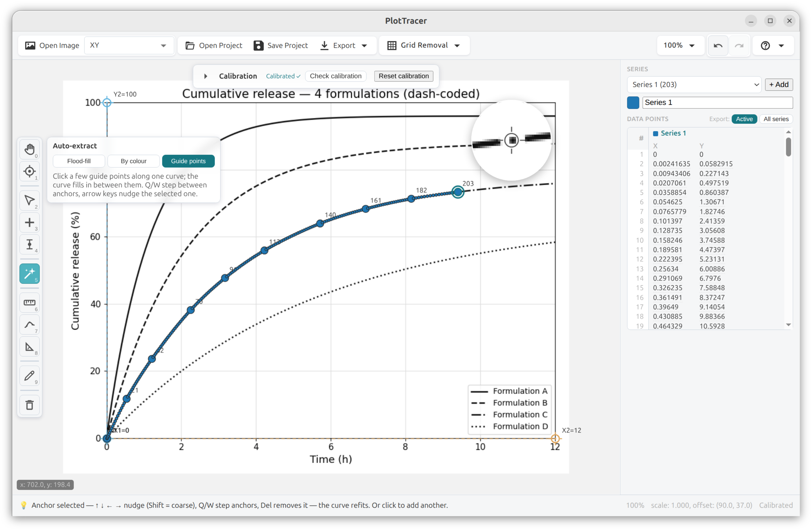

# PlotTracer

[](https://www.gnu.org/licenses/agpl-3.0)

A fully offline, cross-platform desktop application for extracting quantitative data from charts and graphs. Load a figure, calibrate the axes, place or auto-trace points, export to CSV / JSON / Excel / LaTeX / MATLAB / Python — no account, no internet connection, no browser required.

PlotTracer's calibration engine began as an extraction of [WebPlotDigitizer](https://github.com/automeris-io/WebPlotDigitizer) by Ankit Rohatgi (AGPL-3.0); the application — its interface, interaction model, and workflow — is a ground-up rebuild in TypeScript + React + Electron.



---

## Why this exists

An enormous amount of quantitative knowledge exists only as figures. Stress-strain curves, load-displacement data, fatigue life plots, statistical distributions, economic time series, dose-response relationships — published in papers, reports, standards, and regulatory filings, locked inside raster images, unavailable for reanalysis unless someone manually re-extracts the numbers. Plot digitisation is not an exotic edge case; it is a routine part of working with any published or legacy dataset.

Engineers, analysts, and researchers doing this work need a tool they can trust. That means:

- **Auditable.** The code that computes your extracted coordinates is open and inspectable. A black-box cloud service cannot be independently verified, and a proprietary binary cannot be scrutinised. Quantitative conclusions depend on the integrity of the tools used to produce them.
- **Available everywhere.** PlotTracer runs on Linux, Windows, and macOS, installs from a single binary, and works fully offline, including in air-gapped environments.
- **Honest about precision.** The tool records what the figure actually shows — pixels first, values derived from the calibration — and never fabricates precision the source never carried.

No account required, no data sent to any server, and no dependency on any company's continued interest in keeping the lights on.

---

## Features

**Chart / axes types** — XY, Bar, Polar, Ternary, Map (scale bar), Circular Chart Recorder, Histogram (captures true bin *edges*, not just centres), Box Plot, Line with a categorical X axis, and Error Bars.

**Getting points off a figure**
- Manual point placement, multiple series, drag-to-reposition, arrow-key nudge, click-to-edit values.
- **Auto-extract** (one wand tool): flood-fill (Segment Fill), auto-trace by colour (continuous curve *or* scatter markers), a blob detector, and interpolation-assist (guide points + a centripetal spline). A **live mask preview** shows exactly which pixels a trace will capture before you commit, and you can **restrict a trace to a drawn box**.
- Grid-line removal to clean a busy plot first.

**Analysis** — curve fitting (polynomial, degree 1–9, optional x-range), geometry & statistics (arc length, enclosed area, curvature), and a Check-Calibration overlay that draws the calibrated axis box back onto the image.

**Measurements** — distance, angle, area, slope, and a px→real-unit "Set scale" reference, kept as a separate collection from the series data.

**Images & documents** — PNG, JPG, GIF, BMP, WEBP, SVG, **PDF (multi-page)**, and **TIFF / multipage TIFF** (historic scans). Rotate, flip, crop, and fine-angle deskew — all undoable.

**Multi-figure projects** — one project holds several figures (e.g. every page of a paper), each with its own image, calibration, graph type, and series; flip between them and extract another from the retained source.

**Export** — CSV, TSV, JSON, Excel (`.xlsx`), LaTeX, MATLAB, Python, plus a WYSIWYG PNG of the digitised figure. Exported numbers report at a sensible precision (never finer than the pixel grid), and fitted curves export as their own labelled blocks.

**Durable record** — undo/redo across everything, project save/load as a self-contained `.zip` (optionally bundling the source PDF/TIFF), and import of existing WebPlotDigitizer `.tar` projects.

**Fully offline** — no account, no telemetry, no cloud calls.

### Mouse & keyboard

| | |
|---|---|
| Left button | the active tool (place / calibrate / trace / measure …) |
| Ctrl + Left, or Middle button | pan |
| Scroll wheel | zoom |
| Right-click | quick context menu (delete point, edit value, fit to view, …) |
| `Enter` | accept the current step (apply crop, finish area, run calibration) |
| `Esc` | back out of the current step / clear the selection |
| `Del` / `Backspace` | delete the active point or measurement |
| `0`–`9` | switch tools (mirrors the rail) |
| Arrow keys | nudge the selected point/handle (Shift = coarse) |
| `Q` / `W` | step to the previous / next point |
| `Ctrl+Z` / `Ctrl+Shift+Z` | undo / redo |

---

## Download and install

Installers for **Linux** (AppImage + `.deb`), **Windows** (NSIS `.exe`), and **macOS** (`.dmg`) are built by GitHub Actions. Grab them from the artifacts of a [**Build desktop binaries** run](https://github.com/katalystnord/plottracer/actions/workflows/build.yml), or from a tagged [release](https://github.com/katalystnord/plottracer/releases).

> The mac and Windows builds are currently **unsigned** — on first launch macOS Gatekeeper needs a right-click → *Open*, and Windows SmartScreen a *More info → Run anyway*. Code-signing is a planned follow-up.

### Linux — AppImage

```bash
chmod +x plottracer_<version>_x86_64.AppImage
./plottracer_<version>_x86_64.AppImage
```

### Linux — deb (Debian/Ubuntu)

```bash
sudo dpkg -i plottracer_<version>_amd64.deb
```

The post-install step sets the `chrome-sandbox` permissions Chromium's SUID sandbox needs, so no manual `chown`/`chmod` is required.

---

## Build from source

### Prerequisites

- **Node.js** 20 or later (24 is used in CI)
- **npm** (bundled with Node.js)

### Run in development

```bash
git clone https://github.com/katalystnord/plottracer.git
cd plottracer
npm install
npm start          # builds the UI and launches the app (= npm run ui:start)
```

### Package installers locally

```bash
npm run ui:dist:linux   # AppImage + deb
npm run ui:dist:mac     # dmg + zip   (must run on macOS)
npm run ui:dist:win     # nsis .exe   (must run on Windows)
```

macOS and Windows installers can only be produced on their own OS, which is why CI builds all three on GitHub-hosted runners.

### Test / lint / typecheck

```bash
npm test          # vitest (unit + Electron e2e)
npm run lint
npm run typecheck
```

---

## Architecture

PlotTracer is a single Electron application built from four framework-independent layers plus a React shell:

```
plottracer/
├── core/        ← calibration math + data model (the 7 axes classes, Dataset,
│                  the WebPlotDigitizer project-format reader), ported to TypeScript
├── algorithms/  ← pure functions: segment fill, colour trace, blob detect,
│                  interpolation, grid removal, curve fit, geometry, histogram, error bars
├── engine/      ← canvas/Konva rendering, the tool state machine, sessions,
│                  import/export, paged-document (PDF/TIFF) rendering
├── ui/          ← the React shell + the Electron entry/preload/menu (electron-*.cjs)
├── icons/       ← the SVG icon set
├── build/       ← electron-builder config, app icons, packaging hooks
└── samples/     ← bundled example figures (with committed ground-truth values)
```

`core/` and `algorithms/` have no browser dependency; the interactive layer lives in `engine/` and `ui/`.

---

## Attribution

PlotTracer's calibration engine is a TypeScript port of **WebPlotDigitizer** by Ankit Rohatgi, and the whole project is distributed under the same licence.

> WebPlotDigitizer — Copyright 2010–2025 Ankit Rohatgi
> Licensed under the GNU Affero General Public License v3.0
> <https://github.com/automeris-io/WebPlotDigitizer>

Several algorithms (flood-fill curve tracing, grid-line removal, curve fitting, geometry/statistics) are **clean-room** reimplementations of ideas from **Engauge Digitizer** (Mark Mitchell, Jason Nicholson; GPL-2.0) — written from the algorithm descriptions, not translated from the C++ source.

The icon set is derived from **Ketcher** by EPAM Systems (Apache-2.0).

---

## Contributing

Issues and pull requests are welcome. Please note:

- All contributions must be **AGPL-3.0 compatible**.
- The Engauge-derived algorithms must remain **clean-room** rewrites — do not copy GPL-2.0 C++ source.
- PlotTracer records what a figure *shows* and derives values from the calibration; it does not invent or interpret data. Features that would fabricate precision or infer values the pixels don't carry are out of scope by design.

---

## License

GNU Affero General Public License v3.0 — see [LICENSE](LICENSE) for the full text. This licence is inherited from WebPlotDigitizer upstream and must be preserved in all distributions.
