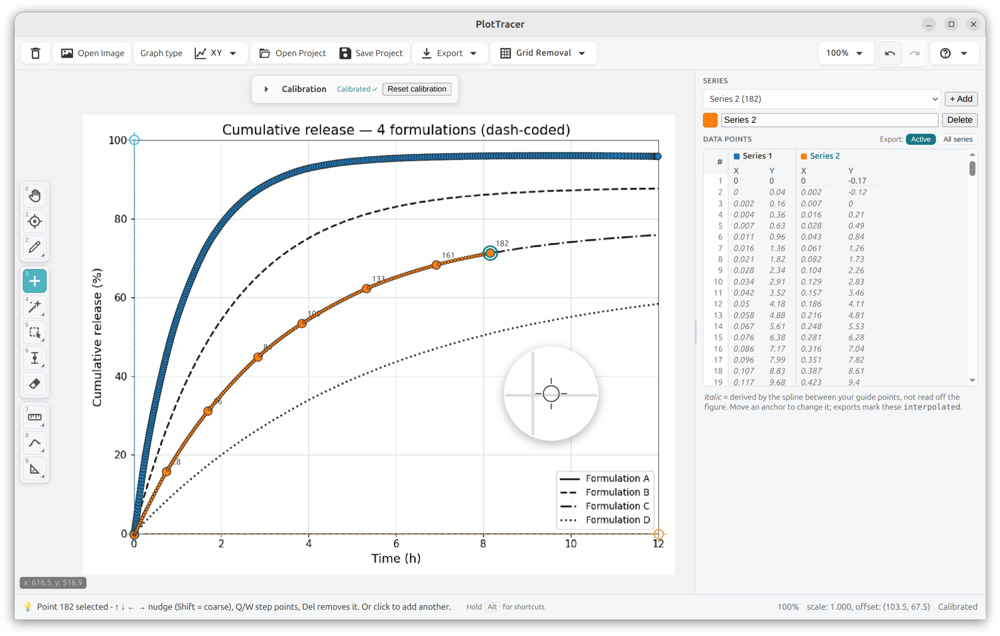

# PlotTracer

[](https://www.gnu.org/licenses/agpl-3.0)

A fully offline, cross-platform desktop application for extracting quantitative data from charts and graphs. Load a figure, calibrate the axes, place or auto-trace points, export to CSV / JSON / Excel / LaTeX / MATLAB / Python / R — no account, no internet connection, no browser required.

PlotTracer's calibration engine began as an extraction of [WebPlotDigitizer](https://github.com/automeris-io/WebPlotDigitizer) by Ankit Rohatgi (AGPL-3.0); the application — its interface, interaction model, and workflow — is a ground-up rebuild in TypeScript + React + Electron.



---

## Why this exists

An enormous amount of quantitative knowledge exists only as figures. Stress-strain curves, load-displacement data, fatigue life plots, statistical distributions, economic time series, dose-response relationships — published in papers, reports, standards, and regulatory filings, locked inside raster images, unavailable for reanalysis unless someone manually re-extracts the numbers. Plot digitisation is not an exotic edge case; it is a routine part of working with any published or legacy dataset.

Engineers, analysts, and researchers doing this work need a tool they can trust. That means:

- **Auditable.** The code that computes your extracted coordinates is open and inspectable. A black-box cloud service cannot be independently verified, and a proprietary binary cannot be scrutinised. Quantitative conclusions depend on the integrity of the tools used to produce them.
- **Available everywhere.** PlotTracer runs on Linux, Windows, and macOS, installs from a single binary, and works fully offline, including in air-gapped environments.
- **Honest about precision.** The tool records what the figure actually shows — pixels first, values derived from the calibration — and never fabricates precision the source never carried.

No account required, no data sent to any server, and no dependency on any company's continued interest in keeping the lights on.

---

## Features

**Chart / axes types** — XY, Bar, Polar, **Spider / Radar** (every spoke calibrated separately, so each axis keeps its own range), **Pie / Donut** (calibrated from the *outline*, so the centre is fitted rather than clicked — which is what makes a donut, an **exploded slice** and a **tilted 3D** pie readable), **Heatmap** (x and y each independently a *category* or a *value*, with the colour key calibrated as a third axis), Ternary, Map (scale bar), Circular Chart Recorder, Histogram (captures true bin *edges*, not just centres), Box Plot, Line with a categorical X axis. Error bars are **not** a graph type — they are a rail tool, captured on top of whichever series they belong to.

**Getting points off a figure**
- Manual point placement, multiple series, drag-to-reposition, arrow-key nudge, click-to-edit values. On a bar or categorical-X figure a **Category** column carries each bar's name — *you* type it, reading the figure's own tick labels; nothing is inferred from the pixels. On a Bar chart the table is one row per category and one column per series, so a grouped figure shows every series at once, and typing a name once updates every series bound to that category. An unnamed bar reads as a **dash, never an invented "Bar 1"** — a placeholder in an export is indistinguishable from a transcription.
- **Auto-extract** (one wand tool): flood-fill (Segment Fill), auto-trace by colour (continuous curve *or* scatter markers), a blob detector, and interpolation-assist (guide points + a centripetal spline). A **live mask preview** shows exactly which pixels a trace will capture before you commit, and you can **restrict a trace to a drawn box**.
- **Bars are captured as a drag-box, corner to corner.** A bar's value is its *extent*, not a point on it, so the two dragged corners **are** the measurement — nothing is averaged or centroided away. That covers plain, grouped, stacked and floating bars, and a bar below the baseline reads negative. **Auto-extract by colour works on Bar and Histogram** for exactly the same reason: a bar blob's own *bounding box* is its two ends. Box Plot and Line still decline it — a box's five letter-values and a categorical point are not a bounding box — rather than quietly return the midpoint.
- **Spider charts trace along their own axes.** A value on a spider is where the series crosses one particular spoke, so auto-extract walks each calibrated ray and records the crossing — one reading per axis, in that axis's own row. A ray the colour crosses more than once records *nothing* and says which axis it gave up on, so the refusals become the worklist rather than a plausible wrong number.
- **Pie charts are captured one click per boundary.** Slices share their edges, so
  the click that closes one sector opens the next, and the first boundary offers to
  close the ring at the end. A pulled-out wedge is measured about **its own tip**
  rather than the pie's centre — sliding a slice sideways does not turn it — which is
  worth several points of share on a real figure *and* invisible without it, because
  the slices still sum to 100 either way.
- **Heatmaps are read from a grid, not clicked.** A heatmap's cells are the record, so you set an adjustable grid of boundaries — detected from the figure's own drawn rules, or laid down by declaring how many categories an axis has — and every cell is read through the calibrated colour key. On a **category axis nothing numeric is typed at all**: you click where the first and last category start and end, and say how many there are. The names you read off the figure travel with the values into the export, and the file says which coordinates are *ordinals* so nobody mistakes band 3 for 3 mm.
- **In a heatmap the colour *is* the value, so every cell carries its own evidence.** Alongside the number, each cell reports the interval it cannot be told apart from, how far its colour sat off the key, how much of the cell was actually that colour, and whether it sits against the key's limit — a cell whose data ran past the key is exact, uniform and **clipped**, which no amount of colour accuracy can recover. A key drawn as a handful of **discrete bands** is refused by name rather than being averaged into a number the figure never printed.
- Grid-line removal to clean a busy plot first.

**Analysis** — curve fitting (polynomial degree 1–9, plus exponential, power-law, logarithmic, Gaussian and logistic models solved by Levenberg–Marquardt; optional x-range), geometry & statistics (arc length, enclosed area, curvature), and a Check-Calibration overlay that draws the calibrated axis box back onto the image.

**Measurements** — distance, angle, area, slope, and a px→real-unit "Set scale" reference, kept as a separate collection from the series data.

**Images & documents** — PNG, JPG, GIF, BMP, WEBP, SVG, **PDF (multi-page)**, and **TIFF / multipage TIFF** (historic scans). Rotate, flip, crop, and fine-angle deskew — all undoable.

**Multi-figure projects** — one project holds several figures (e.g. every page of a paper), each with its own image, calibration, graph type, and series; flip between them and extract another from the retained source.

**Export** — CSV, TSV, JSON, **OpenDocument (`.ods`)**, Excel (`.xlsx`), LaTeX, MATLAB, Python, R (`data.frame`), plus a WYSIWYG PNG of the digitised figure. Any text format can be saved to a file or copied straight to the clipboard. Exported numbers report at a sensible precision (never finer than the pixel grid), and fitted curves export as their own labelled blocks. Where a series has them, exports also carry a **role** column — `anchor` for a point you judged by eye, `interpolated` for one the app filled in between — so the provenance the project file keeps survives the hand-off to someone else.

**Durable record** — undo/redo across everything, project save/load as a self-contained `.zip` (optionally bundling the source PDF/TIFF), and **one-way import of projects written by other digitizers** — the format is recognised from the file's own bytes, never its name, and more formats are added as entries in one registry. Import only: PlotTracer does not write other tools' formats, and could not carry a third of what it records into them.

**Fully offline** — no account, no telemetry, no cloud calls.

### Mouse & keyboard

| | |
|---|---|
| Left button | the active tool (place / calibrate / trace / measure …) |
| Ctrl + Left, or Middle button | pan |
| Scroll wheel | zoom |
| Right-click | quick context menu (delete point, edit value, fit to view, …) |
| `Enter` | accept the current step (apply crop, finish area, run calibration) |
| `Esc` | back out of the current step / clear the selection |
| `Del` / `Backspace` | delete the active point or measurement |
| `0`–`9` | switch tools (mirrors the rail) |
| Arrow keys | nudge the selected point/handle (Shift = coarse) |
| `Q` / `W` | step to the previous / next point |
| `Ctrl+Z` / `Ctrl+Shift+Z` | undo / redo |

---

## Download and install

Installers for **Linux** (AppImage + `.deb`), **Windows** (NSIS `.exe`), and **macOS** (`.dmg`) are built by GitHub Actions. Grab them from the artifacts of a [**Build desktop binaries** run](https://github.com/katalystnord/plottracer/actions/workflows/build.yml), or from a tagged [release](https://github.com/katalystnord/plottracer/releases).

> The mac and Windows builds are currently **unsigned** — on first launch macOS Gatekeeper needs a right-click → *Open*, and Windows SmartScreen a *More info → Run anyway*. Code-signing is a planned follow-up.

### Linux — AppImage

```bash
chmod +x plottracer_<version>_x86_64.AppImage
./plottracer_<version>_x86_64.AppImage
```

### Linux — deb (Debian/Ubuntu)

```bash
sudo dpkg -i plottracer_<version>_amd64.deb
```

The post-install step sets the `chrome-sandbox` permissions Chromium's SUID sandbox needs, so no manual `chown`/`chmod` is required.

---

## Build from source

### Prerequisites

- **Node.js** 20 or later (24 is used in CI)
- **npm** (bundled with Node.js)

### Run in development

```bash
git clone https://github.com/katalystnord/plottracer.git
cd plottracer
npm install
npm start          # builds the UI and launches the app (= npm run ui:start)
```

### Package installers locally

```bash
npm run ui:dist:linux   # AppImage + deb
npm run ui:dist:mac     # dmg + zip   (must run on macOS)
npm run ui:dist:win     # nsis .exe   (must run on Windows)
```

macOS and Windows installers can only be produced on their own OS, which is why CI builds all three on GitHub-hosted runners.

### Test / lint / typecheck

```bash
npm test          # vitest (unit + Electron e2e)
npm run lint
npm run typecheck
```

---

## Architecture

PlotTracer is a single Electron application built from four framework-independent layers plus a React shell:

```
plottracer/
├── core/        ← calibration math + data model (the axes classes, Dataset,
│                  the WebPlotDigitizer project-format reader), ported to TypeScript
├── algorithms/  ← pure functions: segment fill, colour trace, blob detect,
│                  interpolation, grid removal, curve fit, geometry, histogram, error bars
├── engine/      ← canvas/Konva rendering, the tool state machine, sessions,
│                  import/export, paged-document (PDF/TIFF) rendering
├── ui/          ← the React shell + the Electron entry/preload/menu (electron-*.cjs)
├── icons/       ← the SVG icon set
├── build/       ← electron-builder config, app icons, packaging hooks
└── samples/     ← bundled example figures (with committed ground-truth values)
```

`core/` and `algorithms/` have no browser dependency; the interactive layer lives in `engine/` and `ui/`.

---

## Attribution

PlotTracer's calibration engine is a TypeScript port of **WebPlotDigitizer** by Ankit Rohatgi, and the whole project is distributed under the same licence.

> WebPlotDigitizer — Copyright 2010–2025 Ankit Rohatgi
> Licensed under the GNU Affero General Public License v3.0
> <https://github.com/automeris-io/WebPlotDigitizer>

The import filters are verified against **other tools' own project files** — a fixture we authored ourselves would only prove that we agree with ourselves.

Where the licence allows redistribution, those files are committed here unmodified; see [`engine/__tests__/fixtures/wpd/PROVENANCE.md`](engine/__tests__/fixtures/wpd/PROVENANCE.md) for their source and terms. Where it does not, they are not: Engauge Digitizer's test corpus is GPL-2.0, which is incompatible with this project's AGPL-3.0, so none of it lives in this tree. Its reader was instead verified against all 44 of those files **locally**, and the fixtures committed for it are ones we wrote from the format itself.

Several algorithms (flood-fill curve tracing, grid-line removal, curve fitting, geometry/statistics) are **clean-room** reimplementations of ideas from **Engauge Digitizer** (Mark Mitchell, Jason Nicholson; GPL-2.0) — written from the algorithm descriptions, not translated from the C++ source.

PlotTracer also reads **StarryDigitizer** projects (MATO Tomoya; MIT). Its licence permits literal reuse with attribution, but none is taken: only the file FORMAT is read, and the reader is our own code.

> StarryDigitizer — Copyright (c) 2021 MATO Tomoya
> Licensed under the MIT License
> <https://github.com/asaru28/StarryDigitizer>

The icon set is derived from **Ketcher** by EPAM Systems (Apache-2.0).

---

## Contributing

Issues and pull requests are welcome. Please note:

- All contributions must be **AGPL-3.0 compatible**.
- The Engauge-derived algorithms must remain **clean-room** rewrites — do not copy GPL-2.0 C++ source.
- PlotTracer records what a figure *shows* and derives values from the calibration; it does not invent or interpret data. Features that would fabricate precision or infer values the pixels don't carry are out of scope by design.

---

## License

GNU Affero General Public License v3.0 — see [LICENSE](LICENSE) for the full text. This licence is inherited from WebPlotDigitizer upstream and must be preserved in all distributions.
